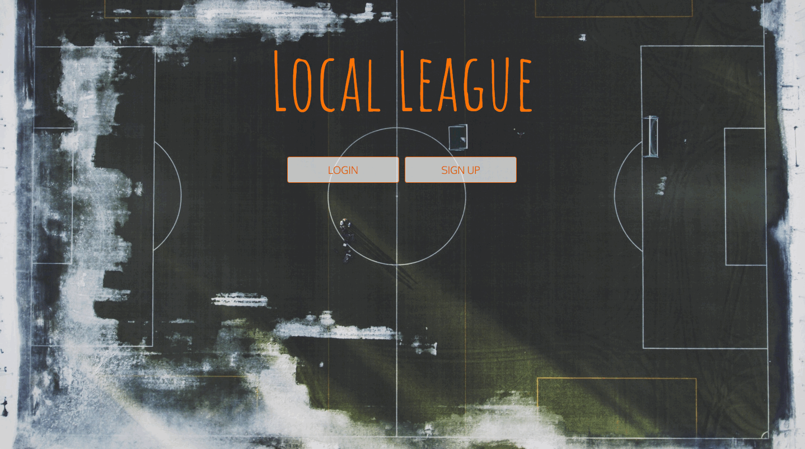

# Local-League

Local-League allows you to post a soccer game and everyone who is registered in this application and lives in your area will get notification text message about the game. In addition, you can check to join other games that have been posted by some other people, check the weather, and add your favorite team.

Link to live DEMO: (https://local-league-app.herokuapp.com/)

## Technologies

- React JS
- JavaScript
- CSS
- Bootstrap
- JSX
- Node JS
- Express
- MongoDB
- mongoose
- axios - Promise based HTTP request library
- Passport
- bcrypt
- Google Maps API
- Twilio API
- Open Weather Map API
- football-data.org API
- freegeoip API
- Heroku
- mLab

## Installing

Clone from my Github to a local repository, then do `yarn install` or `npm install` for both the root directory and client directory. After that run `yarn start` to start the application.

## Author
- Elshibani Omar
